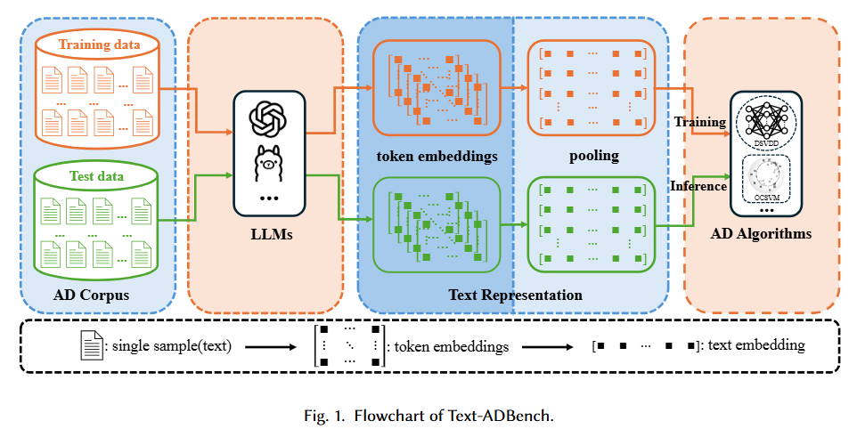
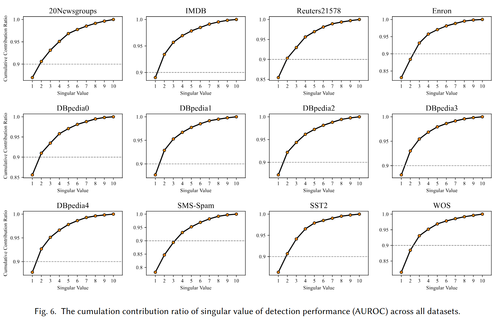
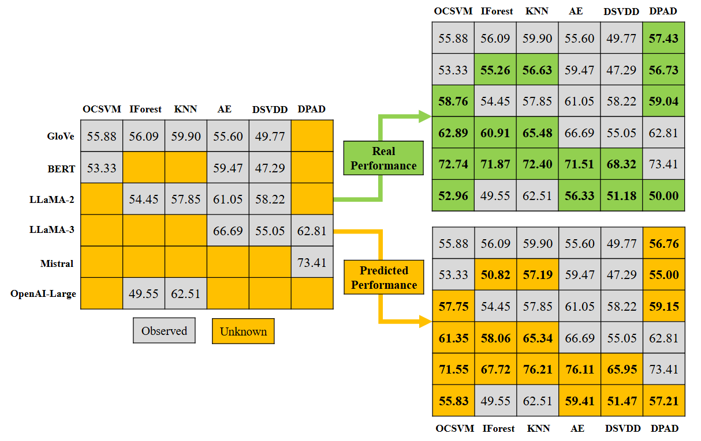

# Text-ADBench ([Text Anomaly Detecion Benchmark based on LLMs Embedding](https://arxiv.org/abs/2507.12295))




## *Abstract*
Text anomaly detection is a critical task in natural language processing (NLP), with applications spanning fraud detection, misinformation identification, spam detection and content moderation, etc. Despite significant advances in large language models (LLMs) and anomaly detection algorithms, the absence of standardized and comprehensive benchmarks for evaluating the existing anomaly detection methods on text data limits rigorous comparison and development of innovative approaches. This work performs a comprehensive empirical study and introduces a benchmark for text anomaly detection, leveraging embeddings from diverse pre-trained language models across a wide array of text datasets. Our work systematically evaluates the effectiveness of embedding-based text anomaly detection by incorporating (1) early language models (GloVe, BERT); (2) multiple LLMs (LLaMa-2, LLama-3, Mistral, OpenAI (small, ada, large)); (3) multi-domain text datasets (news, social media, scientific publications); (4) comprehensive evaluation metrics (AUROC, AUPRC). 
Our experiments reveal a critical empirical insight: embedding quality significantly governs anomaly detection efficacy, and deep learning-based approaches demonstrate no performance advantage over conventional shallow algorithms (e.g., KNN, Isolation Forest) when leveraging LLM-derived embeddings.
In addition, we observe strongly low-rank characteristics in cross-model performance matrices, which enables an efficient strategy for rapid model evaluation (or embedding evaluation) and selection in practical applications.

## **Prerequisites**
1. ### Environment:
    - Python 3.8
    - pip install requirements.txt

2. ### Download Datasets and Embeddings from [Text-ADBench](https://huggingface.co/datasets/Feng-001/Text-ADBench)
    - [text data] 
    - [text embeddings]

3. ### Revise the configuration file `configs.py` and set valid `DATA_DIR` and `EMBEDDING_DIR`

## **Usages**

- ### Text Embedding: `./embedding/`
    - Login in your [Huggingface](https://huggingface.co/) `huggingface-cli login --token your-token`
    - Config Huggingface Token in `./embedding/configs_llms.py`
    - *(optional)* OpenAI Embedding Models: you need to config API-Key to  `./embedding/configs_llms.py`
    - Example: obtaining embedding of *Llama3-8b-mntp* on dataset *sms_spam*

        `python main.py --dataset sms_spam --model_from meta --model Llama3-8b --ft_llm mntp --batch_size 5000 --max_size 28`
    - More Commands: see `text_embedding.sh`
    - For new text data: you must first supplement the corresponding logic for loading data in `./embedding/data_preprocess.py`. Once this preprocessing script has been executed to complete the data preprocessing phase, you can then implement the embedding command for the new dataset.

- ### Anomaly Detection: `./anomaly_detection/`
    - Example: AD algorithm *OCSVM* on dataset *sms_spam*

        `python main.py --dataset sms_spam --ad ocsvm --repeat 1`
    - More Commands: see `anomaly_detection.sh`


- ### Low-Rank Prediction: `./low_rank_prediction/`

    
    

    - The performance matrices from our paper are provided in `performance_matrices`.
    - Example: `python ./low_rank_prediction/matrix_completion.py --missing_rate 0.5 --rank 1`


## **Citation**

1. Our Work

    ```
    @misc{xiao2025textadbenchtextanomalydetection,
      title={Text-ADBench: Text Anomaly Detection Benchmark based on LLMs Embedding}, 
      author={Feng Xiao and Jicong Fan},
      year={2025},
      eprint={2507.12295},
      archivePrefix={arXiv},
      primaryClass={cs.CL},
      url={https://arxiv.org/abs/2507.12295},
    }
    ```

2. The datasets utilized in this repository are publicly accessiable. If you employ any of them from the repository, please ensure to cite the original papers or resources accordingly.

    ```
    http://qwone.com/~jason/20Newsgroups/
    
    https://raw.githubusercontent.com/nltk/nltk_data/gh-pages/packages/corpora/reuters.zi

    http://ai.stanford.edu/~amaas/data/sentiment/

    https://huggingface.co/datasets/stanfordnlp/sst2

    https://huggingface.co/datasets/ucirvine/sms_spam

    https://huggingface.co/datasets/Hellisotherpeople/enron_emails_parsed

    https://huggingface.co/datasets/river-martin/web-of-science-with-label-texts

    https://huggingface.co/datasets/fancyzhx/dbpedia_14
    ```

3. Building upon Llama-2-7B-chat, Mistral-7B-Instruct-v0.2 and Llama-3-8B-Instruct, we employ their fine-tuned versions tailored for text embedding from [LLM2Vec](https://github.com/McGill-NLP/llm2vec/tree/main). Please ensure to cite the original papers if you use the embeddings.

    ### *Llama-2-7B-chat*
    ```
    @article{touvron2023llama,
    title={Llama 2: Open foundation and fine-tuned chat models},
    author={Touvron, Hugo and Martin, Louis and Stone, Kevin and Albert, Peter and Almahairi, Amjad and Babaei, Yasmine and Bashlykov, Nikolay and Batra, Soumya and Bhargava, Prajjwal and Bhosale, Shruti and others},
    journal={arXiv preprint arXiv:2307.09288},
    year={2023}
    }
    ```
    ### *Mistral-7B-Instruct-v0.2*
    ```
    @misc{jiang2023mistral7b,
        title={Mistral 7B}, 
        author={Albert Q. Jiang and Alexandre Sablayrolles and Arthur Mensch and Chris Bamford and Devendra Singh Chaplot and Diego de las Casas and Florian Bressand and Gianna Lengyel and Guillaume Lample and Lucile Saulnier and Lélio Renard Lavaud and Marie-Anne Lachaux and Pierre Stock and Teven Le Scao and Thibaut Lavril and Thomas Wang and Timothée Lacroix and William El Sayed},
        year={2023},
        eprint={2310.06825},
        archivePrefix={arXiv},
        primaryClass={cs.CL},
        url={https://arxiv.org/abs/2310.06825}, 
    }
    ```
    ### *Llama-3-8B-Instruct*
    ```
    @article{llama3modelcard,
    title={Llama 3 Model Card},
    author={AI@Meta},
    year={2024},
    url = {https://github.com/meta-llama/llama3/blob/main/MODEL_CARD.md}
    }
    ```
    ### *LLM2Vec*
    ```
    @inproceedings{
    llm2vec,
    title={{LLM2V}ec: Large Language Models Are Secretly Powerful Text Encoders},
    author={Parishad BehnamGhader and Vaibhav Adlakha and Marius Mosbach and Dzmitry Bahdanau and Nicolas Chapados and Siva Reddy},
    booktitle={First Conference on Language Modeling},
    year={2024},
    url={https://openreview.net/forum?id=IW1PR7vEBf}
    }
    ```


